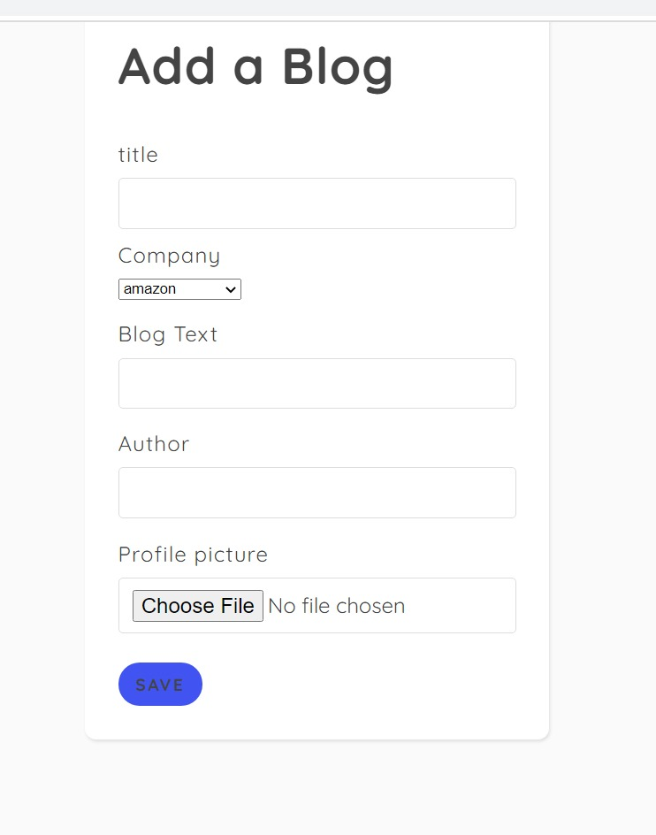

# Interview Tracker Website 

## About The Website

A website made using nodejs and mongodb which aims to help candidates to crack interviews by providing practice questions and previous experiences of company wise successful candidates.

### Setting Up :
1. Install node.js
2. Set up mongo server
3. Install dependancies using npm install command
4. Run site on localhost:4040 using node server.js command

## Tech Stack
1. node.js
2. mongodb
3. html 
4. css
5. javascript
5. express

## Landing Page

The home page (only visible to logged in users) , shall direct to topics and experiences pages 
as well as adding questions and blogs pages.

## Topics Page

Coding related topics listed out which tak users to topics wise questions

## Experiences

Companies listed , with experiences in the form of blogs

## Experience Pages

.         

Experiences with uploaded(by user) images , author name , "read more" and posted date.

## Adding Questions

Questions can be added by anyone and can be viewed by others on being approved by admin.

## Adding Blogs

Blogs can be added by anyone and can be viewed by others on being approved by admin.Author is not a required field. Profile image can be uploaded by user.

## Admin Panel

Admin panel , admins can add , delete and modify models' data .

## Contributors

1. Gitanjit Medhi
2. Gyanendra Prakash

